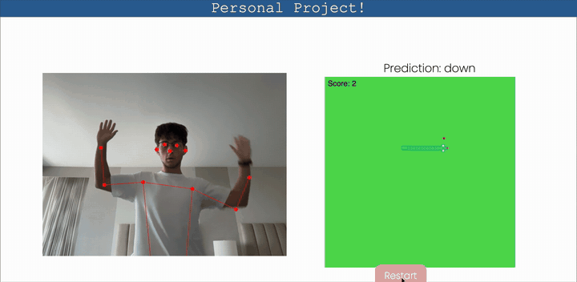
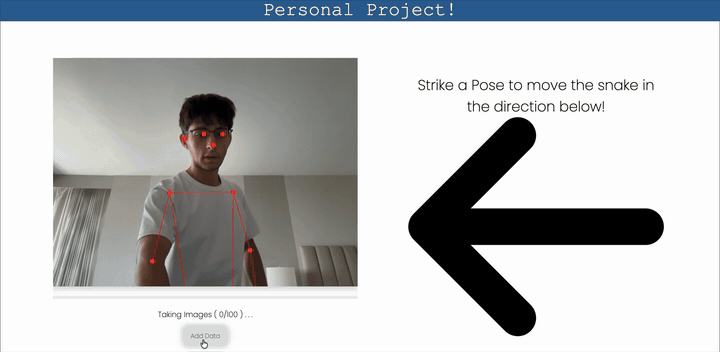
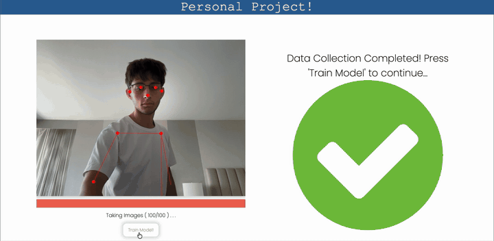

# Pose Snake

Play Snake with your body. Train a pose classifier in your browser in about two
minutes, then steer the snake by leaning up, down, left, or right in front of
your webcam.

No pretrained gesture model is shipped with this project — **you** record the
four poses, and the classifier is trained live in the browser on your own data.
That means it learns whatever poses you feel like using.

**[▶ Try it live](https://franciscomendez114.github.io/pose-snake/)** — needs a
webcam and about two minutes to train.

> Originally built as an IB MYP Personal Project (2023–24).



## How it works

The whole pipeline runs client-side. Your webcam feed never leaves the browser —
there is no backend and nothing is uploaded.

```
webcam ──► PoseNet ──► 17 keypoints ──► normalize ──► 34-value vector
                                                          │
                            ┌─────────────────────────────┴──────┐
                            │                                    │
                    collect 100 samples                  live classification
                    per direction (×4)                   every frame
                            │                                    │
                            ▼                                    ▼
                   train a small neural net  ─────────►  up/down/left/right
                   (ml5, 50 epochs)                             │
                                                                ▼
                                                          snake direction
```

1. **Pose estimation.** [PoseNet](https://github.com/tensorflow/tfjs-models/tree/master/posenet)
   (via ml5.js) finds 17 body keypoints in each webcam frame.
2. **Feature vector.** Each keypoint's `x` and `y` are divided by the frame width
   and height so the features are resolution-independent, giving 34 values per
   frame. Keypoints the model isn't confident about (score ≤ 0.6) are zeroed
   rather than dropped, so every sample stays the same length.
3. **Data collection.** For each of the four directions you get a 3-second
   countdown, then the app records 100 labeled samples at 10 per second. A sample
   is only counted on frames where a body was actually detected.

   
   *Recording the "left" pose — countdown, then 100 samples. Shown at 2× speed.*

4. **Training.** An `ml5.neuralNetwork` classifier trains in-browser on the ~400
   samples — 50 epochs, batch size 5, learning rate 0.15.

   
   *Loss falls from ~1.2 to near zero in around 15 epochs. Shown at 1.5× speed.*

5. **Playing.** Every frame the current pose is classified and the winning label
   is used as the snake's direction.

## Running it

It's a static site, so any web server will do. From the repository root:

```bash
python3 -m http.server 8000
```

Then open <http://localhost:8000>. All libraries (p5.js, ml5.js, progressbar.js)
load from CDNs, so there is nothing to install.

Opening `index.html` directly as a `file://` URL will **not** work — browsers
only grant webcam access on `http://localhost` or HTTPS.

You'll need a webcam, and enough room to be visible from roughly the waist up.

## Using it

1. **Add Data** — strike the pose shown by the arrow, hold it while the counter
   climbs to 100. **Reset** discards that direction's samples if you want to
   redo it.
2. **Move on to next step** — repeat for all four directions.
3. **Train Model!** — takes a few seconds; watch the loss curve in the console.
4. **Start** — the game appears. Pose to steer. Eat apples to grow.
5. Hitting a wall or your own body ends the run. **Restart** starts a new one.

Distinct, exaggerated poses classify far better than subtle ones. Leaning your
whole torso works better than moving one hand.

## Project layout

```
index.html      markup, CDN script tags, and the step-by-step UI
main.js         two p5 sketches: the camera/training panel and the game panel,
                plus all the DOM wiring for the collect → train → play flow
snakeGame.js    Food, Snake, and SnakeGame — game rules and sprite rendering
style.css       layout and styling
images/         apple and snake sprites (head, body, tail, and corner pieces)
docs/           the demo GIFs used in this README
```

The site lives at the repository root so GitHub Pages can serve it directly.

The snake is drawn from individual sprites rather than plain squares:
`Snake.activateSpriteMechanics` picks the right image and rotation for each
segment by comparing it against its neighbours, which is what produces the
rounded corner pieces when the snake turns.

## Known limitations

- Classification accuracy depends entirely on how distinct your four recorded
  poses are; similar poses get confused.
- There's no smoothing on predictions, so a single misclassified frame can turn
  the snake. A short voting window over recent frames would help.
- The board and game speed are fixed (20×20 grid, one step every 20 frames).
- Trained models aren't saved — retrain each time you reload.
- Desktop-oriented layout; the fixed-size canvases don't adapt to small screens.

## Built with

[p5.js](https://p5js.org/) · [ml5.js](https://ml5js.org/) ·
[PoseNet](https://github.com/tensorflow/tfjs-models/tree/master/posenet) ·
[progressbar.js](https://kimmobrunfeldt.github.io/progressbar.js/)

## License

MIT — see [LICENSE](LICENSE).
